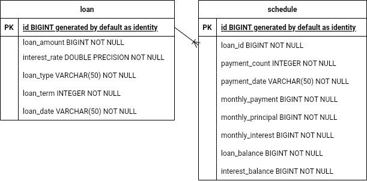

# Loan Scheduler
> 상환방법에 따른 상환 스케쥴 생성 및 조회 , 변경 프로그램 개발

> [상환방법, 대출금액, 상환개월, 대출이율, 대출시작일]를 신청 입력폼으로 처리

> 상환방법 : 원금균등상환, 원리금균등상환

## 개발환경

- InteliJ
- Java11
- Spring Data Jpa
- H2 Database
- Thymeleaf
- BootStrap5

## 데이터베이스 설계



## DDL

```sql
drop table if exists loan CASCADE;
create table loan
(
    id                  BIGINT generated by default as identity,
    loan_amount         BIGINT NOT NULL,
    interest_rate       DOUBLE PRECISION NOT NULL,
    loan_type           VARCHAR(50) NOT NULL,
    loan_term           INTEGER NOT NULL,
    loan_date           VARCHAR(50) NOT NULL,
    primary key (id)
);

drop table if exists schedule CASCADE;
create table schedule
(
    id                  BIGINT generated by default as identity,
    loan_id             BIGINT NOT NULL,
    payment_count       INTEGER NOT NULL,
    payment_date        VARCHAR(50) NOT NULL,
    monthly_payment     BIGINT NOT NULL,
    monthly_principal   BIGINT NOT NULL,
    monthly_interest    BIGINT NOT NULL,
    loan_balance        BIGINT NOT NULL,
    interest_balance    BIGINT NOT NULL,
    primary key (id)
);

alter table schedule
add foreign key (loan_id)
references loan (id);
```

## URI 설계
|기능|RESRful URI|요청방식|
|------|------|------|
|대출스케줄 목록|/loans|GET|
|대출스케줄 상세 화면|/loans/{loanId}|GET|
|대출스케줄 생성(계산) 화면|/loans/add|GET|
|대출스케줄 생성(계산)|/loans/add|POST|
|대출스케줄 수정 화면|/loans/edit/{loanId}|GET|
|대출스케줄 수정|/loans/edit/{loanId}|PUT|


## 클래스 의존관계

